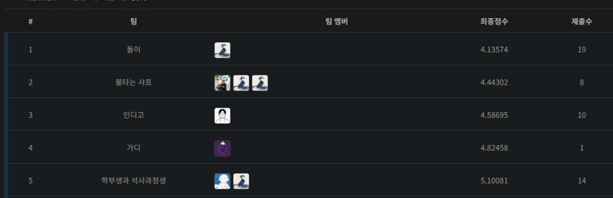

# Dacon-Stock-Price-Prediction
#### Dacon 주식 종가 예측 대회 기록
<https://dacon.io/competitions/official/235800/overview/description>
 
 

## 21. 08. 27

* 대회 기간중 4주에 걸쳐 1주일씩 4번, 주식의 종가를 예측
* BASELINE 모델은 한주(월, 화, 수, 목, 금)의 종가 데이터를 훈련하여 다음 주의 월~금 가격을 예측하는 Linear Regression 모델
  * 이때 월~금 데이터가 별도의 컬럼으로 입력되기 때문에 시간축 특성은 없다고 판단
  * **Score(NMAE * 100) : 4.01163**

* BASELINE 데이터가 시작되는 날짜는 2021. 01. 04. 데이터를 더 추가하고자 날짜를 길게 설정하여 데이터를 늘렸는데 정확도는 오히려 떨어지는 현상이 발생. 다양한 날짜로 시도한 결과, 처음 주어진 날짜를 그대로 사용하는것으로 결정

### 추론 일자 간격 변경

* 예측일자와 너무 먼 데이터는 상관성이 떨어짐. 추론일자와 가까울수록 좋은 데이터이기 때문에 훈련-추론 간격을 5일에서 3일로 수정하여 테스트

* 결과는 오히려 **Score : 4.35175**로 악화

* 다음과 같은 이유로 예상됨

  * 5일 간격으로 추론할때, 추론에 사용된 x는 모두 추론된 값이 아닌 실제 데이터 (좋은 데이터)

    

  

  * 그러나 3일 간격으로 데이터를 재배치하면 다음과 같은 현상이 발생

    

    

  * x2', x3', x4' 를 추론할 때, 실제 데이터인 x4, x5와 추론된 데이터 x1'이 사용됨

  * x1'이 Input으로써 가질 수 있는 최대 퀄리티는 x1' 시기의 실제 Value이기 때문에, 추론값인 x1'는 상대적으로 퀄리티가 낮을 수밖에 없음

  * 결국 낮은 퀄리티의  Input으로 추출된 x2', x3', x4'의 예측치는 기존의 그것보다 높은 ***불확정성***을 가지게 되고, x5'도 마찬가지로 더 높은 불확정성을 가짐 (Garbage in Garbage Out)

    

 

## 21. 08. 28

### 추론 일자 별 모델 앙상블

* 5일을 제외한 다른 일자 간격을 사용하면 필시 불확정성이 생기는 날짜가 존재하게 됨.
  * ex) 1일 : x2' ~ x5', 3일 : x2' ~ x5'
* 그럼에도 간격이 짧을 때, 불확정성이 없는 데이터에 한정해서는 결과 퀄리티가 더 좋다고 가정. 이러한 특징을 살릴 수 있는 방법을 찾음
* 1일 간격으로 학습한 모델로 1일차 데이터를 추론, 2일 간격으로 학습한 모델로 2일차 데이터를 추론하는 방법으로 5일 모두 별개의 모델을 사용하여 추론하는 방법
  * 결과,  **Score : 3.55818**로 향상. 8월 29일 기준으로 리더보드 7위

* 추가적으로 중, 장기 이동평균선을 사용해 예측치를 보정하는 방법 구상

  

 

## 21. 09. 01 - 2주차 리더보드 시작

### 단기 이동평균선 추가

* 이동평균선은 특정 기간동안의 주가 평균을 나타내기 때문에 주가 이동의 추세를 나타내며, 기간이 길어질수록 결측치에 보다 강건하게(Robustness) 대응할 수 있음

* 이동평균선을 사용할 수 있는 두가지 방법 제안

  1. 장단기 이동평균선(20일, 60일 등)을 사용하여 추론일의 이동평균 예측치 생성
  * ex) 추론 이전 20일의 이동평균선을 연장하여 추론할 5일의 이동평균선으로 사용
  2. 종가를 학습하는것과 동일하게 이동평균선을 학습하여 생성, 종가 데이터와 일정 비율로 앙상블
  
     

* 2번 방법을 사용하는것으로 결정. 5일 이동평균선과 20일 이동평균선을 사용하여 일정 비율로 앙상블

  * 결과,  **Score : 3.58686**. 9월 2일 기준으로 리더보드 1위
  
    

 

## 21. 09. 09 - 3주차 리더보드 시작

### 20일 이동평균선 제거

* 모델 보정 및 앙상블 목적으로 추가했던 이동평균선이 close 예측을 저해하는것을 발견

* 특히 20일 이동평균은 중단기의 추세를 유지하기 때문에, 새로운 국면에 들어선 주가의 변동을 반영하지 못함

  

* close 변수의 예측치는 real data의 추세가 반영되나, ma20의 예측치는 추세가 반영되지 못하는것은 물론, 수치 자체도 월등히 낮음

* 3주차 Public으로 test 결과, (0.5, 0.3, 0.2)의 비율로 앙상블했을때 3.2846, close 단일변수 사용시 3.1273 Score 달성

* 20일 이동평균선을 추론에서 제외하는것으로 확정하고, 5일 이동평균선의 비중을 낮추거나 동일하게 제외하는것으로 결정

 

### RandomForest Regressor 추가

* 모델 앙상블을 위해 Randomforest Regressor 추가
* 선형 회귀와 랜덤포레스트의 비율을 0.7 : 0.3으로 앙상블했을시 Score 3.1889로 오차가 소폭 증가하나, Generalization을 기대하고 사용
* Ridge, Lasso 등 기타 회귀모델도 사용해보았으나 큰 차이는 없어 Main model은 Linear Regression으로 계속 사용
* SVR을 추가하여 3가지 모델을 앙상블하는것으로 모델 파트를 마무리 할 예정

 

## 21. 09. 11

### 2주차 private 공개

* 2주차  Private Score : 6.34691로 1위

  

  

###  이동평균선을 변수로 편입

* 이동평균선을 별도의 변수로 사용하여 추론, 앙상블하던 방식에서 X에 편입시켜 한번에 훈련시키는 방법으로 바꿈. 이때 MA는 5에서 3으로 변경
  * 기존 방법
    * X : [close_1, close_2, close_3] -> Y : [close_1', close_2', close_3']
    * X: [ma_1, ma_2, ma_3] -> Y : [ma_1', ma_2', ma_3']
    * 추론 결과를 일정 비율로 섞음
    * 보조지표로써 최적의 이동평균선 날짜를 알 수 없었으며, 마찬가지로 close 추론값과의 앙상블 비중도 휴리스틱하게 결정했음
    * 상황에 따라 악영향을 끼치는 경우도 다수 있었음
  * 개선 방법
    * X : [close_1, close_2, close_3, ma_1, ma_2, ma_3] -> Y : [close_1', close_2', close_3']
    
    * 기준으로 잡은 3일 역시 휴리스틱한 수치이지만, 모델이 학습하며 그에 맞는 가중치를 스스로 학습하기 때문에 기존 방법보다는 훨씬 나을것으로 판단
    
      

 

## 21. 09. 15 - 4주차 리더보드 시작

### MA 변수 삭제

* 이동평균선 변수가 보정 및 보조지표의 역할을 할 것이라는 생각과 달리 변수를 포함하여 학습하였을 때, public 점수가 더 낮게 나옴

* 사실 Close를 측정하는데 가장 좋은 변수는 Close 그 자체이므로 ma가 성능을 저하시켰다고 예상됨

* 따라서 변수에서 MA를 모두 삭제하고, Close 단일로 진행

  

### RandomForest에 GridSearch 사용

* 최적의 파라미터 조합을 찾는 GridSearchCV를 랜덤포레스트에 적용
* 점수는 소폭 상승했지만, 훈련시간이 급격하게 길어짐
  * K-FOLD도 그렇고, GridSearch 또한 굉장히 비효율적인 알고리즘이라고 생각됨... 천장을 뚫는 기법이란것에 의의가 있지만 그럼에도 불구하고 유의미한 조합을 찾는 Cost가 너무 비쌈. 훈련 시간은 6배 이상 증가. 몇몇 값으로 테스트한 뒤, 적당한 값을 휴리스틱하게 선택하는것이 더 효율적일것같음

 

## 21. 09. 18

### 3주차 Private 공개

* 3주차 Private Score : 3.26696으로 2위

* Dacon의 private 채점에 오류가 있었던 것으로 확인됨. 현재 3주차만 수정되어 점수 및 등수 정정

  

### XGBoost 추가

* generalize를 목적으로 앙상블 모델에 추가

  

### Multivariable 테스트

* Close 뿐만 아니라 시가, 고점, 저점 및 거래량과 변동성도 모두 추가하거나 일부 변수만 사용하였지만 Close 단일 변수를 사용하였을 때 가장 성능이 좋았음

  

 

## 21. 09. 26

### 4주차 결과 제출 및 최종 제출 종료

* 최종적으로 linear regression 0.5, randomforest 0.4, xgboost 0.1로 앙상블하여 제출. Public Score : 3.32826
* 4주차 역시 Linear Regression 단독으로 사용할 때 가장 Score가 높았지만 앞선 경험에 미뤄 generalization를 목적으로 앙상블을 사용

 

## 21. 10. 23

### 4주차 결과 발표

* 4주차 Private Score : 5.10081으로 5위

   

 

## 후기

* 주가 데이터는 정상성이 없기 때문에 회귀 예측이 불가능할것같았지만, 1주일 학습 -> 1주일 예측이란 방법으로 기간을 짧게 끊어서 예측함
* LSTM을 사용해서 예측해보았지만 입력 window를 그대로 복사해서 출력하는 문제가 발생함. 원인을 찾아보니 입력값을 그대로 내보내는것이 평균적으로 가장 낮은 loss를 기록하기 때문에 모델이 입력 데이터를 그대로 출력하도록 학습됨. 모델 입장에서는 굉장히 당연하지만 실제론 문제가 있음(VAE가 흐릿한 이미지를 만들어내는것과 동일한 문제)
* 딥러닝을 사용할 수 있는 다른 방법이 있었겠지만(tabnet 등...), 그럼에도 불구하고 딥러닝이 만능이 아님을 느낌. 딥러닝은 도구일 뿐..
* K-fold ensemble을 사용하지 않았던 것이 아쉬움

