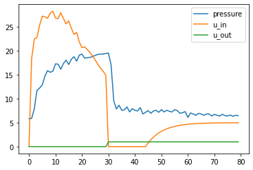

# Kaggle-ventilator-pressure-prediction
#### Kaggle-ventilator-pressure-prediction 대회 기록
<https://www.kaggle.com/c/ventilator-pressure-prediction/overview>
 
 

## 21. 10. 01

* 인공호흡기의 작동에 따라 기도 내부의 압력을 회귀 예측

* ### Columns

  1. id : index
  2. breath_id : breath Index. 같은 breath_id를 가진 row들은 하나의 Sequence
  3. R : 기도저항값. 수치가 높을수록 ventilation이 어려운것같음(u_in이 pressure에 미치는 영향이 낮아지는듯함)
  4. C : 폐탄성. 수치가 높을수록 ventilation이 쉬운것같음
  5. time_step : global timestep
  6. u_in : 흡기 솔레노이드 밸브 제어 압력. 0~100까지 수치를 가지며, 높을수록 많은 공기를 주입함
  7. u_out : 호기 솔레노이드 밸브 제어 입력. 0 or 1의 수치를 가지며, 1일 때 공기를 빼냄
  8. pressure (y) : 기도에서 측정된 압력

* 단순히 전체 변수와 Y를 나눠 예측한 XGB Regressor Score : 5.255 (mae)

 

## 21. 10. 07

* Data Sequence Split

  

* breath_id = 1의 u_in, u_out, pressure
* u_in이 양수일 때, 즉 공기가 들어가고 있을 때 pressure가 점점 상승하다가, u_out이 1로 바뀌는 순간 u_in은 0으로 바뀌고 pressure도 급락함
* 이후 u_in이 다시 상승하지만 pressure에 유의미한 영향은 끼치지 못함. u_out 밸브가 열려있을 때는 영향을 끼치지 못하는것으로 판단
* 즉, u_out=0일 때는 u_in이 pressure에 직접적으로 영향을 미치지만, u_out=1일 때는 특별한 상관관계가 없는것으로 판단
* 데이터를 u_out=0일때를 first sequence, u_out=1일때를 second sequence로 하여 두 부분으로 나누어 훈련, 추론을 진행

 

## 21. 10. 08

* LGBM default param score : 4.773

* 시퀀스를 분리한 데이터를 LGBM으로 훈련, 추론한 결과 score : 4.136 달성

* ### feature selection

  * u_out은 시퀀스를 나누는 역할을 할 뿐, 각 시퀀스에서 pressure에 영향을 미치는 파라미터가 아님. 따라서 시퀀스를 나눈 후 feature에서 제외

  * first sequence에서 pressure는 점차 상승함. 특히 u_in이 높을때 더 가파르게 상승하며, 일종의 누적값과 비슷한 양상을 띔 (total_u_in 변수 plot 추가 예정)

  * 따라서 breath_id별로 시간이 지남에 따라 u_in의 누적값을 측정한 변수를 추가할 예정 : "total_u_in"

  * second sequence에선 u_in이 얼마든지 pressure에 영향을 미치지 못함. 따라서 second sequence에서 u_in 제외

    ### 

  * second 시퀀스를 학습, 추론할 때 추가적인 데이터가 필요할것같음

  * 현재 X (R, C, time_step) - Y (pressure)뿐이기 때문에 pressure와 직접적으로 관련된 데이터가 없음.

  * 따라서 이전 시퀀스의 pressure 정보를 가져올 수 있는 방법이 필요함

    1. 이전 시퀀스에서 생성한 pressure 추론값을 x로 편입하여 사용하던가
    2. 전체 시퀀스를 학습하고 second sequence를 추론하도록 하던가 하는 방법이 필요할것같음

 

## 21. 10. 27

* ### 모델을 딥러닝으로 변경

* 딥러닝으로 바꿈에 따라 데이터도 시퀀스를 나누지 않고 그대로 입력하는것으로 결정

* 기본적인 feature engineering은 코드공유들을 참고함

  <https://www.kaggle.com/cdeotte/lstm-feature-importance> 등등..'

* 기존 EDA에서 사용하지 않는 것으로 결정한 부분은 0 처리하는것으로 데이터에 적용할 예정

* feature importance로 뽑아낸 중요도의 하위부터 drop하며 score를 측정하는것으로 사용할 feature 선택중

 

## 21. 11. 05

* ### 최종 스코어 0.1494, 1085/2659로 종료

* 5.5513 -> 0.1469로 점수 상승
